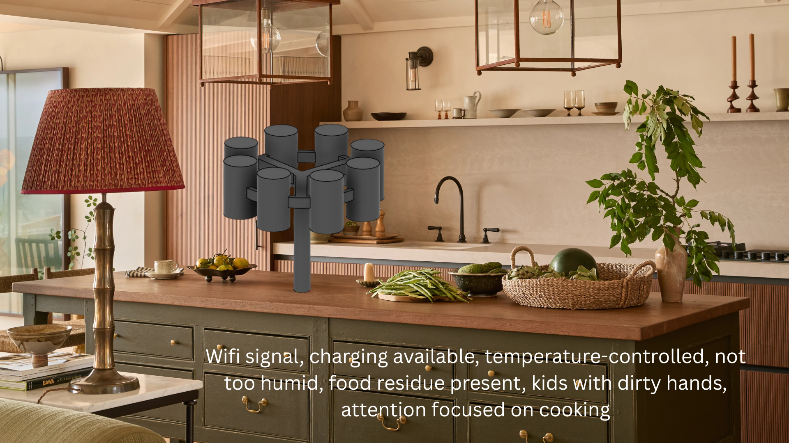

# ID26-TeamF-JJADE

## Context annotation:

## Project description

Overleaf: https://www.overleaf.com/5291415478wrcpcqqynssc#bc740d

Shroom: Seasoning mushroom, it’s a smart seasoning carousel. 

It has refillable seasoning containers suspended upside down on a carousel and a stand in the middle. It has a fixed spot for a pot to dispense the seasonings into. It has a screen for control, voice activation, and an emergency stop button. It has feedback when conducting actions and a scale built in. It has an internal inventory of spices.  

## Form links

Questionnaire: https://forms.cloud.microsoft/Pages/DesignPageV2.aspx?subpage=design&FormId=MH_ksn3NTkql2rGM8aQVG7ev5I1rnphDvzFYtnuI8nVUQlFXUE5JUTc3RkFYQkZWMDU5WFdJUDY3Ti4u&Token=f2f5c6287ad84e18b2ff1daaacd7bd13

Consent Form: https://forms.office.com/Pages/ResponsePage.aspx?id=MH_ksn3NTkql2rGM8aQVGz3Gm2ZJz09BvdxG4GCUxdxUQ1c1MjFHVEZPV0dQOU1SUExNTlpCNlpUVC4u

## Team members
- Jamie
- James
- Arsalan
- Dan
- Elsa
