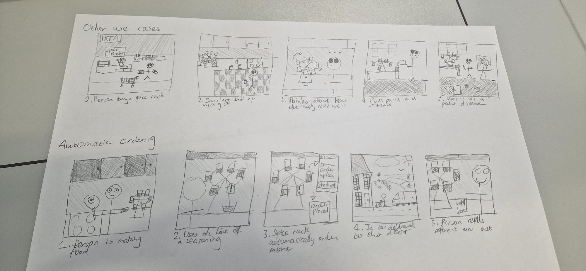

# ID26-TeamF-JJADE

## Project description

Overleaf: https://www.overleaf.com/5291415478wrcpcqqynssc#bc740d

### Shroom 🍄

A Smart, Accessible Seasoning Carousel

Shroom is a smart seasoning carousel designed to make cooking more engaging, intuitive, and accessible — especially for individuals with visual impairments.

The Problem:

Research shows that one of the most urgent challenges for visually impaired individuals in the kitchen is locating and correctly identifying ingredients. Items are often misplaced, misidentified, or obscured by camera blind spots. While multi-sensory solutions such as Braille labels and recorded audio tags exist, they present limitations:

- Prone to misidentification
- Slow and cumbersome to browse
- Require high manual effort to label and maintain
- Often lack scalability and efficiency

This creates a gap between accessibility and usability — current tools may be accessible, but they are not always efficient or engaging.

Our Solution:

Shroom bridges this gap by combining audio and visual cues with an interactive physical design to create a more equitable cooking experience.

Key features include:

🔊 Multi-sensory identification – Audio and visual feedback for accurate spice selection

🌱 Custom refillable containers – Suspended on a rotating ring for intuitive access

⚖️ Gravity-based dispensing and measuring – Simple, mechanical, and precise

📉 Personalized low-stock alerts – Smart notifications when spices are running low

🍳 Recipe and pairing suggestions – Encourages discovery of new combinations

🧠 Engagement-focused design – Promotes learning and confidence in cooking

 ## Context annotation:

## Commands to run code:
1. Start backend: cd code/backend => python3 app.py
2. Start frontend: cd code/frontend => npm run dev

## Form links

Questionnaire: https://forms.cloud.microsoft/Pages/ResponsePage.aspx?id=MH_ksn3NTkql2rGM8aQVG7ev5I1rnphDvzFYtnuI8nVUQlFXUE5JUTc3RkFYQkZWMDU5WFdJUDY3Ti4u

Consent Form: https://forms.office.com/Pages/ResponsePage.aspx?id=MH_ksn3NTkql2rGM8aQVGz3Gm2ZJz09BvdxG4GCUxdxUQ1c1MjFHVEZPV0dQOU1SUExNTlpCNlpUVC4u

## Context

| Storyboard | Description |
| :--- | :--- |
|  | Alternative ways the spice rack might be used by users and automatic ordering.  |

## Related Works
Auditory Seasoning Filters: Altering Food Perception via Augmented Sonic Feedback of Chewing Sounds
https://dl.acm.org/doi/10.1145/3544548.3580755 

AROMA: Mixed-Initiative AI Assistance for Non-Visual Cooking by Grounding Multimodal Information Between Reality and Videos
https://dl.acm.org/doi/10.1145/3746059.3747650 

OSCAR: Object Status and Contextual Awareness for Recipes to Support Non-Visual Cooking
https://dl.acm.org/doi/10.1145/3706599.3720172 

## Team Mascot:

## Teaching Assistants

Lead: Jack Burnett

Assistant: Hancheng Li

## Team members
Team email: jjade-id2026@bristol.ac.uk

- Jamie
- James
- Arsalan
- Dan
- Elsa
